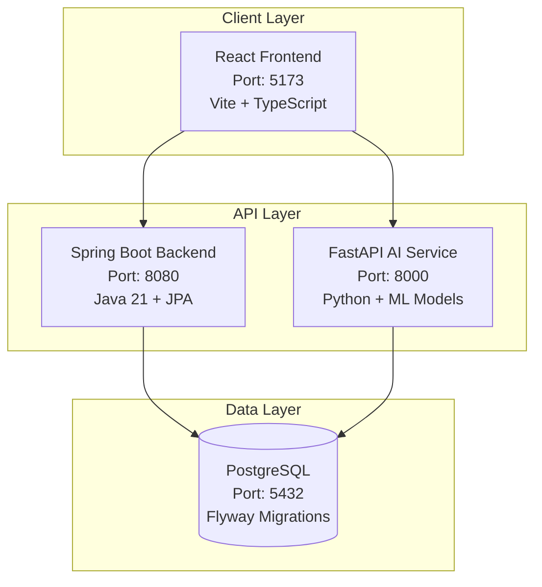

# 🌱 AgroVision - Agricultural Intelligence Platform

## 📋 Table of Contents

- [System Overview](#-system-overview)
- [Architecture & Technology Stack](#-architecture--technology-stack)
- [Service Communication](#-service-communication)
- [Development Environment](#-development-environment)
- [Database Architecture](#-database-architecture)
- [Getting Started](#-getting-started)
- [API Documentation](#-api-documentation)
- [Contributing](#-contributing)

---

## 🏗️ System Overview

AgroVision is a comprehensive **agricultural intelligence platform** that leverages computer vision and machine learning to provide real-time crop analysis, disease detection, and yield predictions. The platform enables farmers and agricultural professionals to make data-driven decisions through automated video analysis of crops and fields.

### **Key Features:**

- **🔍 Computer Vision Analysis**: Automated crop health assessment from video uploads
- **🦠 Disease & Pest Detection**: AI-powered identification of plant diseases and pest infestations
- **📊 Yield Prediction**: Statistical analysis and forecasting of crop yields
- **🌾 Crop Counting**: Automated counting of fruits, vegetables, and plants
- **📈 Farm Management**: Comprehensive farm and field management system
- **🎯 Treatment Recommendations**: Evidence-based treatment suggestions

### **Technology Stack:**

- **Frontend**: React 19 with Vite and TypeScript
- **Backend**: Spring Boot 3.5.4 with Java 21
- **AI Service**: FastAPI with Python (Computer Vision & ML)
- **Database**: PostgreSQL 16 with Flyway migrations
- **Cache**: Redis 7 for session management
- **Development**: Direct development (recommended) or Docker (partial support)

---

## 🏛️ Architecture & Technology Stack

### **System Architecture**



### **Service Communication**

#### **Frontend ↔ Backend API**
- **Technology**: RESTful HTTP APIs with JSON
- **Endpoints**: `/api/v1/*` for all backend services

#### **Backend ↔ Database**
- **ORM**: Spring Data JPA with Hibernate
- **Connection Pooling**: HikariCP (default with Spring Boot)
- **Migrations**: Flyway for version-controlled database schema changes
- **Connection**: `jdbc:postgresql://localhost:5432/agrovision`

#### **Backend ↔ AI Service**
- **Integration**: HTTP REST API calls for ML processing
- **Data Flow**: Video upload → Backend storage → AI analysis → Results storage
- **Async Processing**: Background job processing for long-running analyses

---

## 🚀 Development Environment

### **Prerequisites**

- **Java 21** (OpenJDK recommended)
- **Node.js 18+** with **pnpm**
- **Python 3.11+** with **pip**
- **PostgreSQL 16** (for direct development)
- **Redis 7** (for caching)
- **Git**

**Optional:**
- **Docker & Docker Compose** (for containerized development - currently has backend connectivity issues)

### **Quick Start**

#### **1. Clone & Setup**
```bash
git clone <repository-url>
cd AgroVision
```

#### **2. Development Options**

**Option A: Direct Development (Recommended)**
```bash
# Use the development launcher
./dev.sh

# Choose option 2 (Direct Development)
# Then option 6 (Launch all services)
```

> **✅ Status**: Fully working and tested. All services (Backend, Frontend, AI Service) start correctly and endpoints are accessible.

**Option B: Docker Development (Currently Limited)**
```bash
# Use the Docker development launcher
./dev.sh

# Choose option 1 (Docker Development)
```

> **⚠️ Status**: Docker environment has backend database connectivity issues. Frontend, AI Service, PostgreSQL, Redis, and development tools (PgAdmin, Redis Commander) work correctly. Backend container fails to connect to PostgreSQL database despite correct configuration.

**Option C: Manual Development**
```bash
# Start services manually in separate terminals:

# Terminal 1: Backend
cd backend  
./gradlew bootRun

# Terminal 2: Frontend
cd frontend
pnpm install
pnpm dev

# Terminal 3: AI Service
cd ai-service
source .venv/bin/activate
uvicorn app.main:app --reload
```

> **✅ Status**: Alternative to Option A for manual control over each service.

### **Service URLs**

| Service | URL | Purpose | Direct Dev | Docker Dev |
|---------|-----|---------|------------|------------|
| Frontend | http://localhost:5173 | React application | ✅ | ✅ |
| Backend API | http://localhost:8080 | Spring Boot REST API | ✅ | ❌ |
| AI Service | http://localhost:8000 | FastAPI ML service | ✅ | ✅ |
| PostgreSQL | localhost:5432 | Database | ✅ | ✅ |
| Redis | localhost:6379 | Cache | ✅ | ✅ |
| PgAdmin | http://localhost:5050 | DB Management | N/A | ✅ |
| Redis Commander | http://localhost:8081 | Redis Management | N/A | ✅ |

### **Backend Development**

#### **Spring Boot Commands**
```bash
cd backend

# Run application
./gradlew bootRun

# Build JAR
./gradlew build
```

### **Frontend Development**

```bash
cd frontend

# Install dependencies
pnpm install

# Start development server
pnpm dev
```

---

## 🎯 Getting Started

### **Development Workflow**

1. **Use Development Launcher**: `./dev.sh` → Choose Direct Development
2. **Setup Services**: Choose option 2 to setup dependencies
3. **Launch All Services**: Choose option 6 to launch all services in separate terminals
4. **Optional Database Terminal**: Choose option 7 to launch services + database terminal
5. **Direct Database Access**: Choose option 10 to connect to PostgreSQL terminal

### **Project Structure**

```
AgroVision/
├── frontend/          # React application
├── backend/           # Spring Boot API
├── ai-service/        # FastAPI ML service  
├── docker-compose.yml # Production setup (backend issues)
├── docker-compose.dev.yml # Development setup (backend issues)
└── docs/             # Additional documentation
```

---

### **Additional Documentation**

Detailed development commands and troubleshooting guides are available in:
- [`docs/commands.md`](docs/commands.md) - Comprehensive command reference
- [`docs/GIT_WORKFLOW.md`](docs/GIT_WORKFLOW.md) - Git workflow guidelines