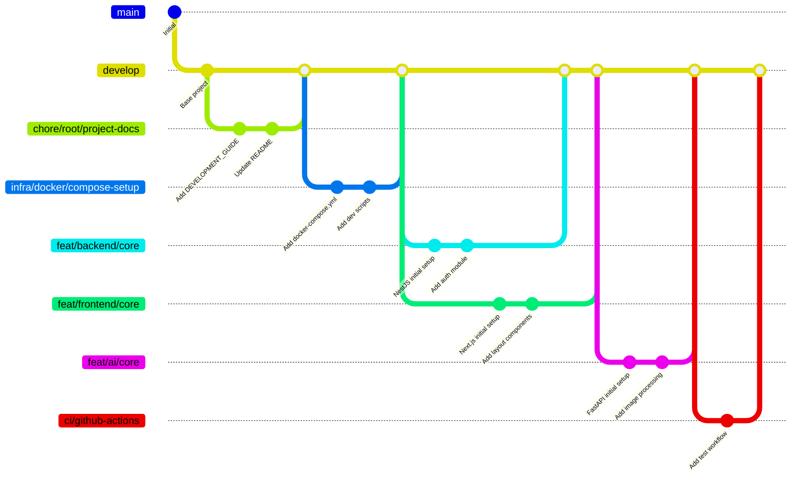

Here's a professional Git workflow tailored for your multi-service monorepo project, following industry best practices and conventional commit standards:

### Branch Naming Convention

Use the format: `[type]/[service]/[short-description]`

**Types:**

- `feat/`: New features
- `fix/`: Bug fixes
- `chore/`: Maintenance tasks
- `docs/`: Documentation
- `refactor/`: Code improvements
- `infra/`: Infrastructure changes
- `ci/`: CI/CD pipelines

**Service Prefixes:**

- `frontend/`
- `backend/`
- `ai/`
- `db/`
- `infra/` (for Docker/compose)
- `scripts/`
- `root/` (repo-wide changes)

**Examples:**

- `feat/frontend/authentication-ui`
- `fix/backend/auth-bypass`
- `chore/ai/update-dependencies`
- `infra/docker-compose-dev-setup`
- `ci/github-actions-pipeline`

### Commit Message Convention (Conventional Commits)

```
[type][(scope)]: [description]

[Body (optional)]

[Footer (optional)]
```

**Examples:**

```bash
feat(backend): add user authentication module

- Implemented JWT auth strategy
- Created user registration endpoint
- Added role-based access control

Closes #123
```

```bash
fix(ai): handle image processing edge cases

- Fixed memory leak in image preprocessing
- Added error handling for corrupt uploads
- Improved validation for image formats

Resolves #456
```

```bash
chore(root): update project documentation

- Updated DEVELOPMENT_GUIDE.md
- Added service diagrams to PROJECT_ORGANIZATION.md
- Fixed broken links in README
```

```bash
infra(docker): optimize dev container sizes

- Reduced backend container size by 40%
- Multi-stage builds for ai-service
- Shared common layers between services
```

### Branch Strategy



### Service-Specific Commit Scopes

1. **Frontend**:
   - `feat(frontend/auth): login form`
   - `fix(frontend/upload): file validation`
   - `refactor(frontend/layout): responsive design`

2. **Backend**:
   - `feat(backend/users): CRUD operations`
   - `fix(backend/db): connection pooling`
   - `chore(backend): update NestJS to v10`

3. **AI Service**:
   - `feat(ai/models): disease detection`
   - `perf(ai/inference): optimize prediction`
   - `docs(ai): add model training guide`

4. **Database**:
   - `feat(db/migrations): add users table`
   - `fix(db/schema): relation constraints`

5. **Infrastructure**:
   - `infra(docker): add GPU support`
   - `chore(scripts): fix permissions`

### Pull Request Conventions

**Title Format:**  
`[Service] [Type]: Short Description`  
Example: `[Backend] [Feat]: Implement user authentication`

**Description Template:**

```markdown
## Summary
Brief description of changes

## Changes
- Change 1
- Change 2

## Impact
Affected services: [list services]

## Related Issues (if it exists)
Closes #123, Fixes #456

## Checklist
- [ ] Tests pass
- [ ] Documentation updated
- [ ] No breaking changes
```

### Release Strategy

1. `develop` - Main development branch
2. `release/v1.0` - Release stabilization branches
3. `main` - Production-ready code (protected)
4. `hotfix/` - Critical production fixes

### Best Practices

1. **Atomic Commits**: Each commit should represent a single logical change
2. **Service Isolation**: Keep changes service-specific when possible
3. **Commit Message Verbs**: Use imperative mood ("Add" not "Added")
4. **Meaningful Descriptions**: Explain WHY, not just WHAT
5. **Reference Issues**: Always link to related issues/tickets
6. **Branch Cleanup**: Delete merged branches
7. **Regular Rebasing**: Rebase feature branches weekly
8. **Commit Signature**: GPG-sign important commits

### Example Workflow

```bash
# Start new feature
git checkout -b feat/frontend/crop-selection develop

# Make changes
git add .
git commit -m "feat(frontend/crop): add crop type selector

- Created CropPicker component
- Added thumbnail images
- Integrated with state management"

# Push and create PR
git push origin feat/frontend/crop-selection
```

This structure provides:

1. Clear ownership of service-specific changes
2. Professional commit history for technical reviewers
3. Automated changelog generation potential
4. Easy navigation through project evolution
5. Compliance with standard open-source practices

Technical reviewers will immediately recognize:

- Your understanding of monorepo management
- Professional approach to version control
- Attention to maintainable project structure
- Commitment to collaborative development standards
